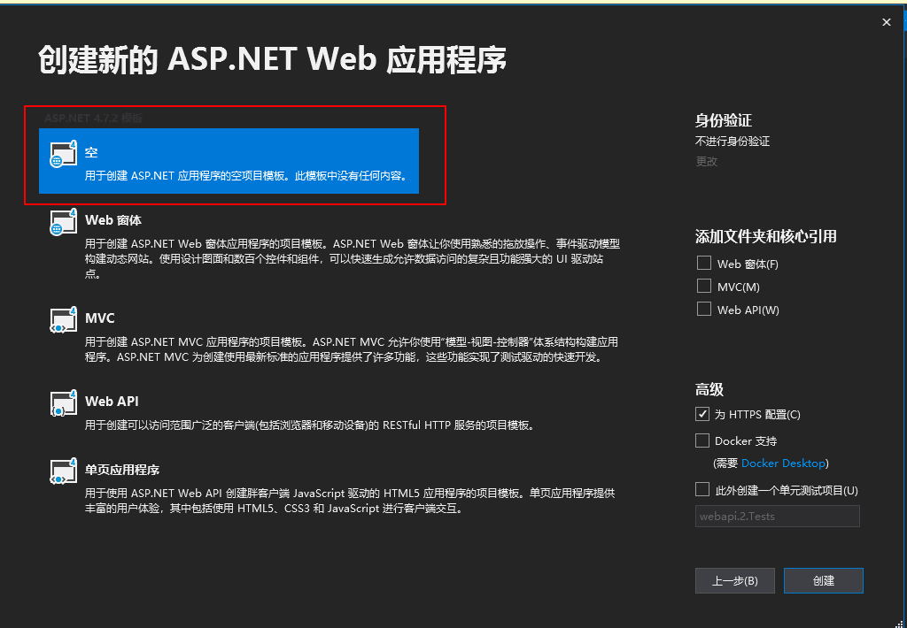
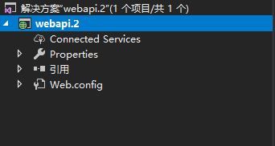
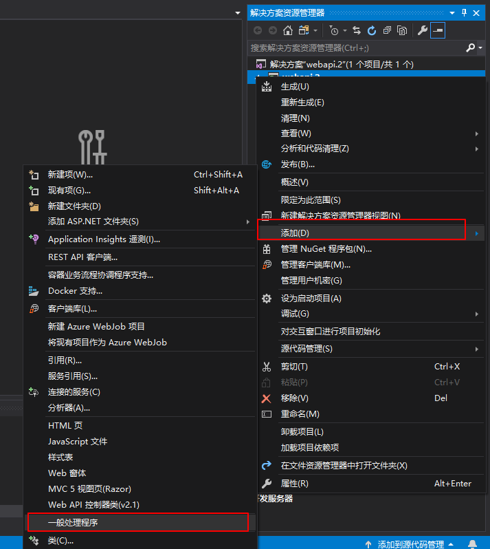
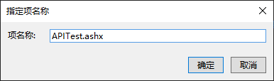

# create c# webrestful api

> 教程使用的是vs2019

1. 打开vs 
	- 依次选择: `文件 -> 新建 -> 项目`

> 

2. 点击创建
> 
3.  选择空白项目
> 
4.  项目目录如下 
> 
5.  右键项目, 添加 -> 一般处理程序
>  
6.  一般处理程序命名 APITest.ashx
>   
7.  wewqewqew